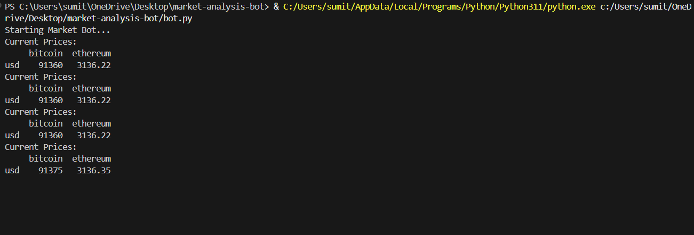

# market-analysis-bot
# Automated Market Analysis Bot

## Overview
A Python automation script designed to fetch, clean, and analyze financial market data on a scheduled interval.

## Key Features
* **Automation:** Runs continuously on a 10-minute schedule.
* **Error Handling:** Implements exponential backoff for API reliability.
* **Logging:** Automatically logs data and errors to a file for audit.

## Libraries Used
* `requests` (API Handling)
* `pandas` (Data Analysis)
* `logging` (System Monitoring)

## Demo

Below is the terminal output showing the Python script actively fetching and displaying real-time price data in a loop.

